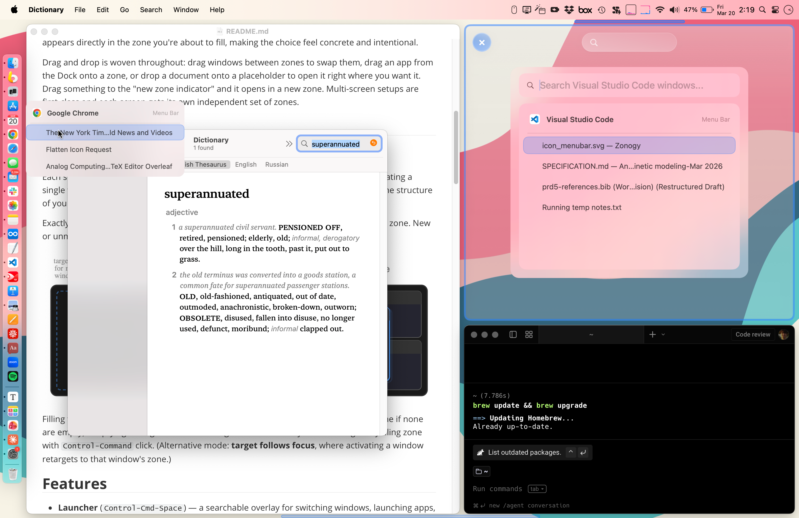
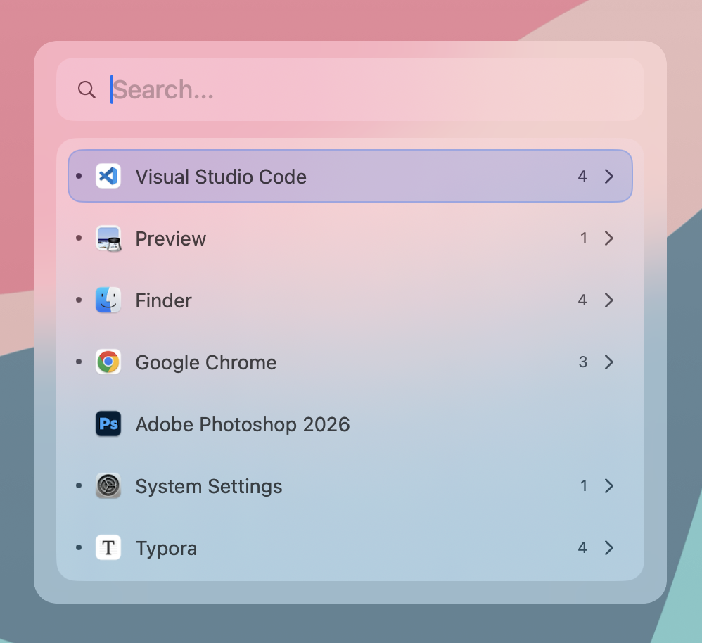
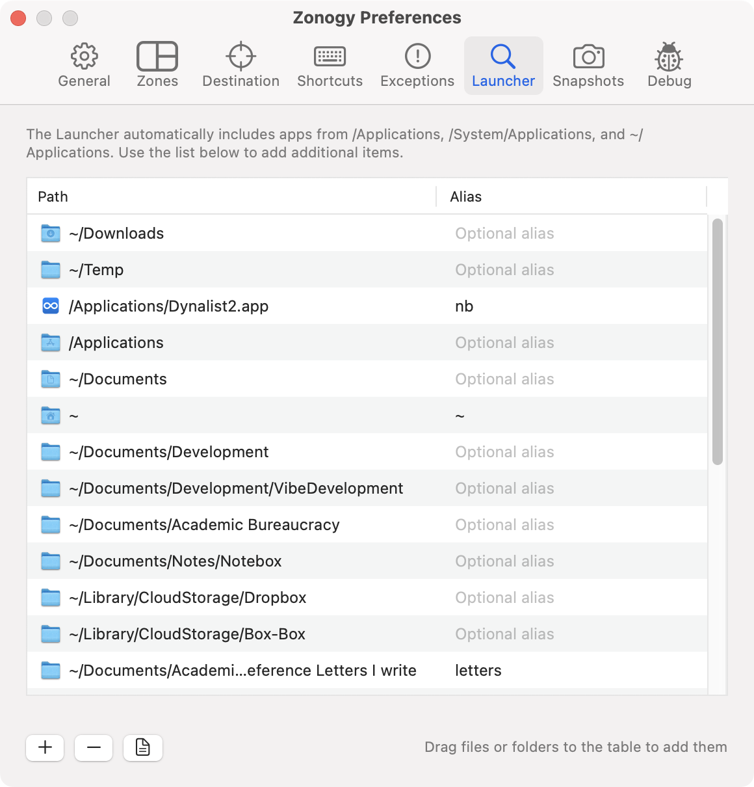
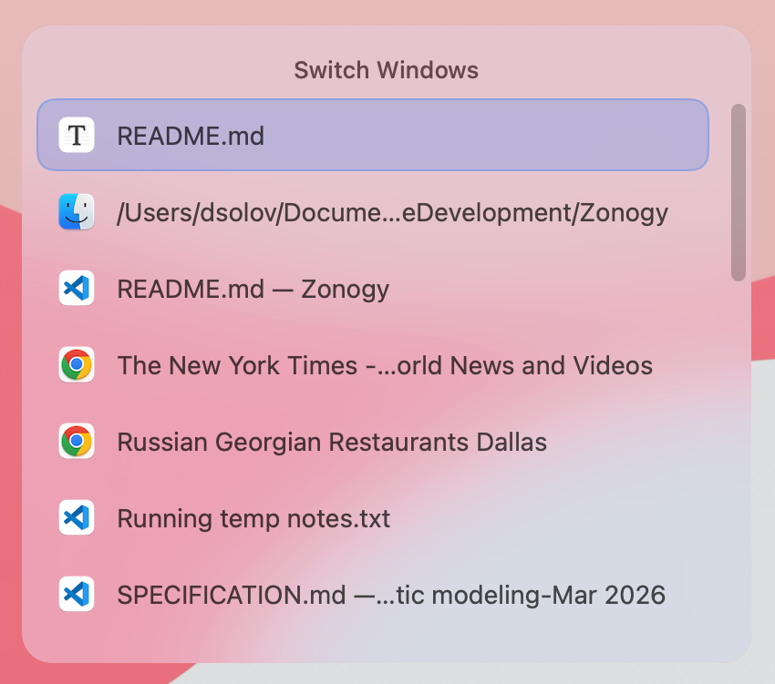
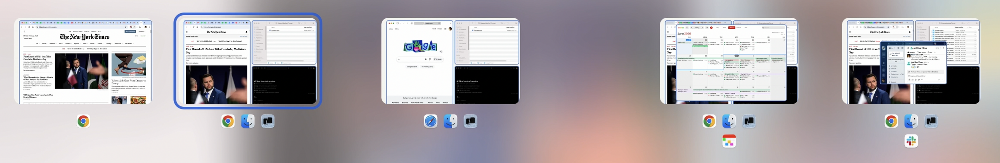
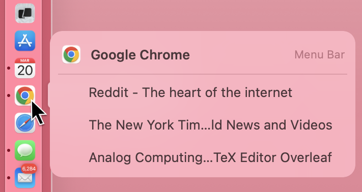

# Zonogy

Zonogy is a zone-based window manager for macOS. (The name suggests "the origin or formation of zones.") Zonogy is free and open source (MIT license).

Zonogy divides each screen into persistent tiling zones plus a floating zone. At any time, one zone is the destination for the next window. A keyboard-driven Launcher and hover-over Dock menus let you quickly find any window. Window arrangements can be snapshotted and restored to switch working contexts.

> Philosophy: An intentional place for every window.



## Overview

Zonogy rethinks multiple aspects of the operating system UI, including window management, virtual desktops, application/window launching, and interacting with the Dock.

**Window management:** To tame window clutter, Zonogy defines non-overlapping tiling zones for holding windows. Zones persist even when empty, so the layout stays stable. An additional floating zone on each screen can float a window above others without disrupting the tiling zones.

> **Comparison with auto-tiling window managers (e.g., yabai, Amethyst, AeroSpace):** Automatic tiling can feel twitchy because every time you open, close, or minimize a window, the entire layout reflows to fill the screen. These tools also force all available space to be filled, even when windows have a natural maximum size. Instead, Zonogy "reserves space" for additional windows.

**Virtual desktops**: Virtual desktops like macOS's built-in Spaces have a limitation that a window can only belong to one space, yet the same window often belongs to more than one task. With Zonogy's **WinShot snapshots**, you can save and restore different window arrangements that could share the same windows.

**Application/window launching and switching:** Most launchers and Spotlight let you switch to an *application*, or a specific *document*, but not a specific *window.* Zonogy's **CmdTab** replacement allows fast switching between recent windows across all applications. **DockMenus** lets you hover over any Dock icon to pick a specific window of that app, or just click the Dock icon to open the app's "main" or most recently used window. The **Launcher** lets you switch to any app in a few keystrokes, or drill down into an app and search its windows by title. The Launcher also allows general shortcuts to files and folders with optional aliases (search keywords), and learns over time.

Drag and drop is woven throughout: Windows can be dragged between zones. An app can be dragged from the Dock to a zone to open it there, and similarly for documents or URLs. Items can be dragged onto visual indicators (along screen edge) to place them in a new tiling zone or the floating zone.

Multi-screen setups are first-class and each screen gets its own independent set of zones and snapshots.

## Core Concepts

### Zones

Each screen has 1–3 **tiling zones** that form the main layout, plus a **floating zone** for floating a single window above the tiles. Empty tiling zones show a "placeholder" so you can see the structure of your layout and drag content into them. Zones can be resized by dragging the separator between them (which appears on mouse hover), and the windows adjust automatically. See [Resizing Zones vs. Windows](docs/resizing-zones-vs-windows.md) for more detail.

Exactly one zone is the **destination** at any moment, indicated by a glowing indicator. New or unminimized windows are always placed into the destination zone.


Filling the destination tiling zone advances to the next empty tiling zone, or the floating zone if no zone is empty. Emptying a tiling zone makes it the destination automatically. You can also make any tiling zone the destination with `Control-Cmd`-click.

## Features

- **Launcher** (`Control-Cmd-Space`) — a searchable overlay for switching windows, launching apps, and opening folders or documents. Fuzzy matching with smart ranking: it learns which items you pick for each query and prioritizes them next time. Supports optional short aliases for quick access. The Launcher appears directly in the destination zone where the window will appear. Hold `Option` while selecting an app row to open a new window of that app instead of activating the existing one.



- **CmdTab** (`Cmd-Tab`) — a fast window chooser replacing the macOS app switcher. Hold Cmd and tap Tab to cycle windows ordered by recency. The chooser appears directly in the destination zone where the window will appear.



- **WinShot Snapshots** (`Control-Cmd-/` to save, `Control-Cmd-Tab` to browse) — save and restore entire window arrangements and zone layouts. A visual timeline chooser lets you scrub through past snapshots.



- **DockMenus** — hover over any Dock icon to see a compact panel of that app's windows. Click to activate, or drag the icon or a window entry onto a zone to place it there. Shift-click bypasses Zonogy for normal Dock behavior.



- **ActiveFit** — windows in the right column that can't shrink to fit are automatically shifted into view when focused (outside of their zone's bounds), then slide back when you move on.
- **UnderCovers mode** — reveal the desktop and unmanaged windows.

## Mouse Controls

| Gesture | Action |
| --- | --- |
| Click new zone pill (on right edge of each screen) | Add a tiling zone |
| Click floating zone destination indicator (on bottom edge of each screen) | Set the floating zone as destination |
| `Control-Cmd`-click anywhere in a zone (even if zone is occupied) | Set that zone as destination |
| Drag resize bar between zones (appears on hover) | Adjust zone proportions live |
| Drag window → tiling zone | Move it there, swapping if occupied |
| Drag window → new zone pill | Add a zone and place the window in it |
| Drag window → floating zone indicator | Float the window above the tiles |
| Hold `Control-Cmd` during window drag | Promote between tiled and floating zone |
| Drag file or URL → empty zone or new zone pill | Open it there in the default app |
| Hold `Control-Cmd` during file or URL drag | Replace zone occupant with the dragged item opened in default app |
| Drag Dock icon or DockMenu window → zone | Place that window there (or launch the app) |
| Hold `Option` while dragging a Dock icon, DockMenu window, or Launcher app row | Drop on a zone opens a new document/window of that app there (as if `Cmd-N` pressed) |

## Default Keyboard Shortcuts (configurable)

> **Tip:** Most default Zonogy shortcuts use `Control-Cmd` as the modifier. See [Additional Suggestions](#additional-suggestions) below for using [Karabiner-Elements](https://karabiner-elements.pqrs.org/) to remap `Caps Lock` to `Control-Cmd`.

| Shortcut | Action |
| --- | --- |
| `Control-Cmd-=` | Add a zone |
| `Control-Cmd--` | Remove zone (preferring empty, keeping current window open) |
| `Control-Cmd-0` | Collapse to one zone (same as pressing remove zone repeatedly until one tiling zone remains) |
| `Cmd-M` | Minimize active window; with Launcher open, removes the zone (so `Cmd-M` twice = minimize + remove zone) |
| `Cmd-Tab` | CmdTab window switcher (<code>Cmd-\`</code> cycles current app's windows) |
| `Control-Cmd-/` | Save WinShot snapshot |
| `Control-Cmd-Tab` | Browse WinShot snapshots |
| `Control-Cmd-H/J/K/L` | Change destination zone (Vim keys: left/down/up/right) |
| `Control-Cmd-Arrows` (hold) | Focus a window: arrows move a dot across windows, release to focus |
| `Control-Cmd-\` | Toggle destination with focused window |
| `Control-Cmd-Return` | Focus the destination zone's window |
| `Control-Cmd-Space` | Open Launcher in destination zone |
| `Control-Cmd-Escape` | Clear zones on active screen (optionally automatically saving snapshot). Pressing twice resets to single-zone layout. |

## Requirements

- **macOS** — tested on Sequoia 15.7.3+ and Tahoe 26.3+
- **Accessibility Permissions** — required for window management (moving, resizing, and reading window properties via the Accessibility API) and for global keyboard/mouse event monitoring (CmdTab's Cmd-Tab override, shortcuts, and clicking a zone to set the destination)
- **Screen Recording Permissions** — only needed for the WinShot snapshot feature, which captures screenshot thumbnails for the snapshot chooser.
- **Automation Permissions** — needed to open web links in a new browser window when URLs are dropped onto zones. macOS will prompt you to grant Automation access for each browser individually. This applies to Safari, Chrome, and Edge (which use AppleScript). Firefox uses direct process launching instead and does not require this permission.

## Limitations

- **Not fully compatible with native MacOS tabs.** The available APIs make it difficult to distinguish native tabs from separate windows, and to handle native tab events as expected. (Note that tabs in Safari, Chrome, and many other applications are not "native" MacOS tabs, and thus cause no issues.) While basic native tab handling works, there are edge cases that do not (e.g. dragging tabs between windows, Merge All Windows, etc). I suggest *System Settings* > *Desktop & Dock* > *Prefer tabs when opening documents*: "Never".
- **Not compatible with native MacOS Spaces or Stage Manager.** Zonogy is meant to replace these native features.

## Per-App Exceptions

Apps don't expose enough information for Zonogy to always make the right choices about which windows to manage and how. The [Exceptions](docs/preferences-exceptions.md) tab of Zonogy Preferences lets you add per-app overrides.

## Additional Suggestions

- **Highly recommended.** Since Zonogy uses window minimization extensively, I suggest *System Settings* > *Desktop & Dock* > *Minimize windows using*: "Scale Effect" (appears faster than the default Genie), and *System Settings* > *Desktop & Dock* > *Minimize windows into application icon*: on (so minimized windows don't fill up the Dock).
- Remove the Zoom button floating menu; we won't use the Zoom button for anything other than making the window full-screen.

  ```sh
  $ defaults write -g NSZoomButtonShowMenu -bool no
  $ # to bring it back:
  $ defaults delete -g NSZoomButtonShowMenu
  ```

- Most default Zonogy shortcuts use `Control-Cmd` as the modifier. Using [Karabiner-Elements](https://karabiner-elements.pqrs.org/) to remap `Caps Lock` to `Control-Cmd` is very convenient. The [config I use](docs/karabiner-elements.md) sets this up, with the bonus that tapping `Caps Lock` on its own opens the Launcher.

## Development

Zonogy is developed with [Claude Code](https://claude.ai/claude-code) and [Codex](https://openai.com/index/codex/), following a specification-driven approach. The `SPECIFICATION*.md` files in the repo serve as the single source of truth for behavior and double as detailed documentation — see them for a much more extensive description of Zonogy's functionality than this README covers.

## History

My day job is [teaching and research at UT Austin](https://www.solo-group.link/), but better UI is a passionate hobby. I originally built Zonogy for myself and decided to share it in case others find it useful. The project is unapologetically *opinionated* and reflects how I work. For example, I've never needed more than 3 tiled windows per screen (plus a floating-zone slot), so that defines the current limit. Of course, Zonogy is open source, and contributions, experiments, and personal forks are all welcome.
