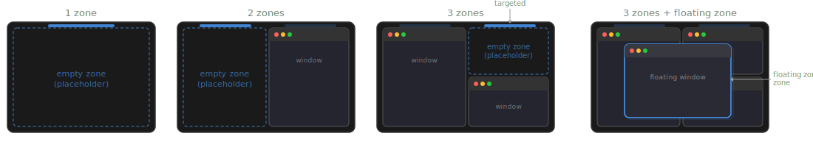

# Zonogy

**Zonogy** is a zone-based window manager for macOS. (Name means "the origin or formation of zones.")

Replace the launch-then-arrange ritual with predictable window placement.

<!-- IMAGE: Hero screenshot showing a 3-zone layout on a wide display — zone 1 (left column) with a code editor, zone 2 (right-top) with a browser, zone 3 (right-bottom) with a terminal. Target indicator visible above one empty zone. -->

## Why Zonogy?

Tiling window managers promise to tame a cluttered screen — but they feel **twitchy**. Every time you open, close, or minimize a window, the entire layout reflows. Zonogy takes a different approach: you define **zones** that persist even when empty, so your layout stays **stable**. Exactly one zone is always **targeted**, and that's where the next window will appear.

Virtual desktops like macOS's built-in Spaces have another limitation: a window can only belong to one space. With Zonogy's **WinShot snapshots**, you can save and restore different window arrangements that could share the same windows. After all, the same window — your email, a reference doc — often belongs to more than one task; your tools shouldn't force you to choose.

In addition, Zonogy tackles a gap in window switching: most launchers and Spotlight let you switch to an *application*, but not a specific *window* within it. Zonogy offers two complementary paths here. **DockMenus** let you hover over any Dock icon to see that app's windows and pick one — or just click the icon to open the app's "main" or most recently used window. The **Launcher** takes a keyboard-first approach: drill down into an app and search its windows by title, all within an overlay that appears directly in the zone you're about to fill — making the choice feel concrete and intentional.

Drag and drop is woven throughout: drag windows between zones to swap them, drag an app from the Dock onto a zone, or drop a document onto a placeholder to open it right where you want it. Drag something to the "new zone indicator" and it opens in a new zone. Multi-screen setups are first-class — each screen gets its own independent set of zones.

## Core Concepts

### Zones

Each screen has 1–3 **tiling zones** that form the main layout, plus a **temporary zone** for floating a single window above the tiles. Empty zones show a "placeholder" so you can see the structure of your layout and drag content into them.

Exactly one zone is **targeted** at any moment, indicated by a glowing indicator above the zone. New or unminimized windows are always placed into the targeted zone.

Filling the targeted tiling zone advances to the next empty tiling zone (or the temporary zone if none are empty), emptying a tiling zone makes it targeted, and you can retarget any tiling zone with a `Control-Command` click. (Alternative mode: **target follows focus**, where activating a window retargets to that window's zone.)

## Features

- **Launcher** (`Control-Cmd-Space`) — a searchable overlay for switching windows, launching apps, and opening folders or documents. Fuzzy matching with smart ranking: it learns which items you pick for each query and prioritizes them next time. Supports optional short aliases for quick access. Appears directly in the targeted zone and auto-shows when a zone becomes empty.

<!-- IMAGE: The Launcher overlay visible inside an empty zone, showing a search field with a list of app icons and window titles. -->

- **AltTab** (`Cmd-Tab`) — a fast window switcher replacing the macOS app switcher. Hold Cmd and tap Tab to cycle windows ordered by recency. (<code>Cmd-`</code> cycles windows of the current application.)

- **WinShot Snapshots** (`Control-Cmd-/` to save, `Control-Cmd-Tab` to browse) — save and restore entire window arrangements. A visual timeline chooser lets you scrub through past snapshots.

<!-- IMAGE: The WinShot chooser strip showing snapshot thumbnails with a timeline rail above them, connectors linking each timeline point to its thumbnail, and one snapshot highlighted/selected. -->

- **DockMenus** — hover over any Dock icon to see a compact panel of that app's windows. Click to activate, or drag the icon or a window entry onto a zone to place it there. Shift-click bypasses Zonogy for normal Dock behavior.

<!-- IMAGE: A DockMenu panel floating above a Dock icon, showing the app's icon/name header and a short list of its managed windows. One zone in the background is highlighted as if a drag target. -->

- **ActiveFit** — windows in the right column that can't shrink to fit are automatically shifted into view when focused (outside of their zone's bounds), then slide back when you move on.
- **Drag and drop** — drag windows between zones to swap or rearrange. Drop files or URLs onto empty zones to open them directly in the right place.
- **UnderCovers mode** — reveal the desktop and unmanaged windows.

## Default Keyboard Shortcuts (configurable)

> **Tip:** Most default Zonogy shortcuts use `Control-Cmd` as the modifier. Using [Karabiner-Elements](https://karabiner-elements.pqrs.org/) to remap Caps Lock to `Control-Cmd` makes all of them single-hand accessible — e.g., Caps Lock + Space opens the Launcher.

| Shortcut | Action |
| --- | --- |
| `Control-Cmd-=` | Add a zone |
| `Control-Cmd--` | Remove zone (following preference order) |
| `Control-Cmd-Click` | Target clicked tiling zone |
| `Control-Cmd-Arrows` | Change target zone with arrow keys |
| `Control-Cmd-Space` | Open Launcher |
| `Control-Cmd-Escape` | Clear zones on active screen (optionally automatically saving snapshot). Pressing twice resets to single-zone layout. |
| `Control-Cmd-/` | Save WinShot snapshot |
| `Control-Cmd-Tab` | Browse WinShot snapshots |
| `Cmd-Tab` | AltTab window switcher |
| `Cmd-M` | Minimize active window; with Launcher open, removes the zone (so `Cmd-M` twice = minimize + remove zone) |

## Requirements

- **macOS** — tested on Sequoia 15.7.3 and Tahoe 26.3
- **Accessibility** — required for window management (moving, resizing, and reading window properties via the Accessibility API) and for global keyboard/mouse event monitoring (AltTab's Cmd-Tab override, shortcuts, and zone click targeting)
- **Screen Recording** — only needed for the WinShot snapshot feature, which captures screenshot thumbnails for the snapshot chooser.
- **Automation** — needed to open web links in a new browser window when URLs are dropped onto zones. macOS will prompt you to grant Automation access for each browser individually. This applies to Safari, Chrome, and Edge (which use AppleScript). Firefox uses direct process launching instead and does not require this permission.

## Development

Zonogy is developed with [Claude Code](https://claude.ai/claude-code) and [Codex](https://openai.com/index/codex/), following a specification-driven approach. The `SPECIFICATION*.md` files in the repo serve as the single source of truth for behavior and double as detailed documentation — see them for a much more extensive description of Zonogy's functionality than this README covers.

## History

My day job is [teaching and research at UT Austin](https://www.solo-group.link/), but window management is a (passionate and strangely obsessive) hobby. I originally built Zonogy for myself and decided to share it in case others find it useful. The project is unapologetically **opinionated** — it reflects how I work. For example, I've never needed more than 3 tiled windows per screen (plus a temporary floater), so that's the limit. Zonogy is open source, and contributions, experiments, and personal forks are all welcome.
