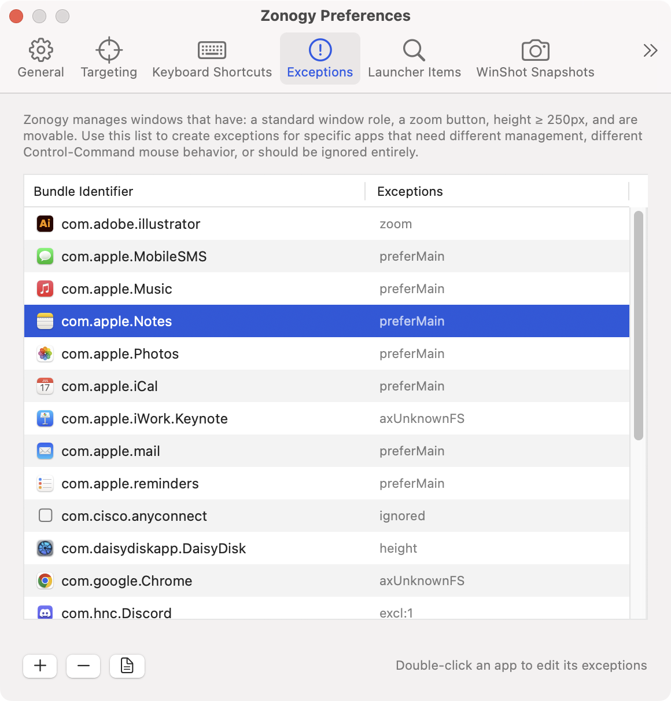
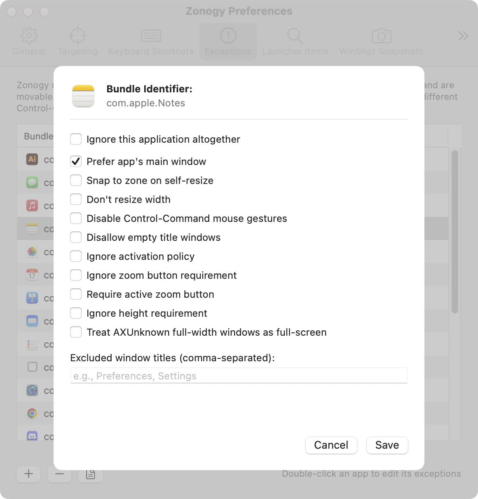

# Exceptions

Apps don't always expose enough information for Zonogy to make the right choices about which windows to manage and how. To handle the gap, Zonogy includes an exceptions system, accessible through *Preferences* > *Exceptions*, and a configuration .json file.

By default Zonogy manages a window only if it has a standard AX window role, exposes a zoom button, is at least 250px tall, and is movable. Most exceptions either loosen one of these checks for a specific app, or tighten behavior to handle an app's quirks.

## The exceptions list

Each row is one app, keyed by **bundle identifier** (e.g. `com.apple.Dictionary`). Add picks from the eligible running apps; double-click a row to edit. *Reveal Config File* icon (bottom on window) opens `~/Library/Application Support/Zonogy/config.json`; edits to that file take effect via the menu bar's *Reload Launcher Items and Exceptions*.

## Per-app options

Double-clicking a row opens the editor sheet for that app:

**Ignore this application altogether.** Windows from this app are never managed.

### Loosening or tightening eligibility

- **Ignore zoom button requirement.** Manage windows that don't have a zoom button.
- **Require active zoom button.** Only manage windows whose zoom button is enabled (not grayed out) — useful for apps that gray out the button on palette and inspector windows.
- **Ignore height requirement.** Manage windows shorter than 250px.
- **Ignore activation policy.** Manage helper or accessory apps that aren't `.regular`.
- **Disallow empty title windows.** Skip the app's empty-titled windows (which are managed by default).

### Adjusting placement and resize

- **Don't resize width.** Set position and height when placing the window in a zone, but leave the width alone.
- **Snap to zone on self-resize.** If the app resizes a tiled window internally (e.g., opening an inspector panel), snap it back immediately. User edge-drags still follow the normal [resize behavior](resizing-zones-vs-windows.md).
- **Treat AXUnknown full-width windows as full-screen.** Workaround for apps whose presentation windows report `AXUnknown` instead of `AXFullScreen` (Keynote slideshows are the canonical case).

### Other

- **Prefer app's main window.** Some apps have logically one main window (e.g., Mail.app) plus various secondary ones. By default Launcher and DockMenus activate the app's most-recently-used window; this option instead tries to pick the main window (by the heuristic of choosing the lowest internal window ID).
- **Disable Control-Command mouse gestures.** Zonogy normally intercepts Control-Command clicks for setting the destination zone, and Control-Command drags for moving windows between tiled and floating zones. For apps that use Control-Command for their own gestures, this option lets the app receive them instead.
- **Excluded window titles.** Comma-separated list of exact titles to ignore from this app.

## Editing config.json directly

The UI covers the common cases; the underlying `config.json` is the source of truth and supports a few fields the UI doesn't expose (such as `deriveBundleIdFromPathForProcesses` for Java apps). See the *Configuration* section of [SPECIFICATION.md](../SPECIFICATION.md). When figuring out *why* a particular window isn't being managed, Zonogy logs which eligibility checks each candidate passed or failed.
