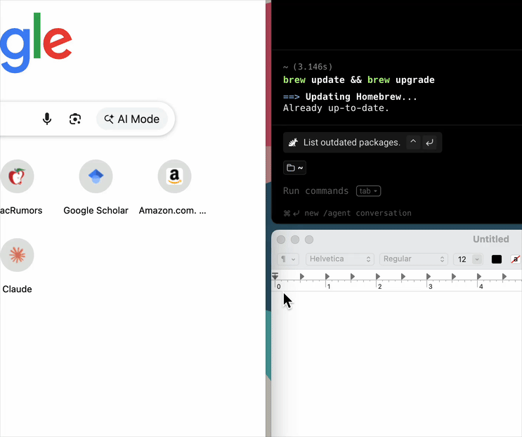
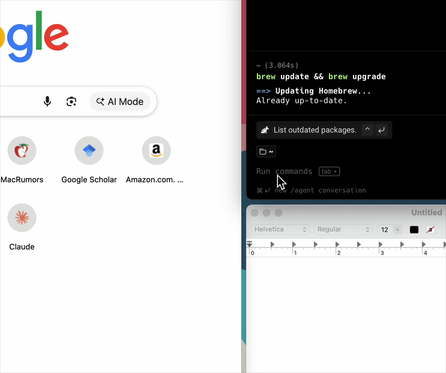

# Resizing Zones vs. Resizing Windows

Zonogy has two kinds of resize that serve very different purposes.

**Zone resize** changes your layout. Hover over the margin between two zones to reveal a thin white separator bar, then drag it to adjust how much of the screen each zone gets. All windows in the affected zones reflow to match, and the new proportions persist across sessions and snapshots.

**Window resize** is a temporary override. Drag a managed window's edge the normal macOS way, and it detaches from its zone frame — useful for peeking at content that doesn't quite fit. The window snaps back to its zone dimensions when you activate another window.

